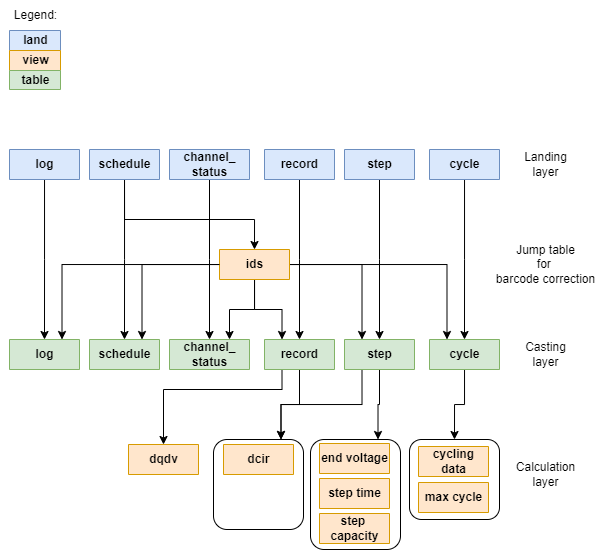

# Neware Database Documentation
Minimal documentation and list of queries 
## Database structure

## List of variables and types
|     | Table          | Select   | Parameter                               | Unit           |   Decimal point | Type of data   | Length string   | Field name                         | Default value   | Primary Key   | new name                 |
|----:|:---------------|:---------|:----------------------------------------|:---------------|----------------:|:---------------|:----------------|:-----------------------------------|:----------------|:--------------|:-------------------------|
|   0 | channel_status | True     | Computer name                           | nan            |             nan | string         | 20              | nan                                | nan             | nan           | computer_name            |
|   1 | channel_status | True     | Device ID                               | nan            |               0 | int            | nan             | equiptCode                         | nan             | nan           | equipt_code              |
|   2 | channel_status | True     | Unit ID                                 | nan            |               0 | int            | nan             | channelNo                          | nan             | nan           | channel_no               |
|   3 | channel_status | True     | CH ID                                   | nan            |               0 | int            | nan             | channelCode                        | nan             | nan           | channel_code             |
|   4 | channel_status | False    | Local IP                                | nan            |             nan | string         | 20              | localIP                            | nan             | nan           | nan                      |
|   5 | channel_status | True     | Computer name                           | nan            |             nan | string         | nan             | pcName                             | nan             | nan           | pc_name                  |
|   6 | channel_status | True     | Barcode                                 | nan            |               0 | string         | 60              | packBarCode                        | empty string    | YES           | barcode                  |
|   7 | channel_status | False    | System state                            | nan            |             nan | string         | nan             | systemStatus                       | nan             | nan           | nan                      |
|   8 | channel_status | False    | Test program name                       | nan            |             nan | string         | nan             | solutionName                       | nan             | nan           | nan                      |
|   9 | channel_status | False    | Test project name                       | nan            |             nan | string         | nan             | projectName                        | nan             | nan           | nan                      |
|  10 | channel_status | False    | Test project number                     | nan            |             nan | string         | nan             | projectNO                          | nan             | nan           | nan                      |
|  11 | channel_status | True     | Step Index                              | nan            |               0 | int            | nan             | stepNO                             | nan             | nan           | step_id                  |
|  12 | channel_status | False    | Cycle group number                      | nan            |             nan | string         | nan             | cycleGroupNO                       | nan             | nan           | nan                      |
|  13 | channel_status | True     | Cycle count                             | nan            |               0 | int            | nan             | cycleCount                         | nan             | nan           | cycle_id                 |
|  14 | channel_status | True     | Step Time                               | ms             |               0 | bigint         | nan             | stepTime                           | nan             | nan           | step_duration            |
|  15 | channel_status | True     | Total Time                              | ms             |               0 | bigint         | nan             | totalTime                          | nan             | nan           | total_duration           |
|  16 | channel_status | True     | Charge and discharge system state       | nan            |             nan | string         | 20              | btsSysState                        | nan             | nan           | nan                      |
|  17 | channel_status | False    | Charge and discharge operation mode     | nan            |             nan | string         | nan             | btsRunMode                         | nan             | nan           | nan                      |
|  18 | channel_status | False    | Charge and discharge control mode       | nan            |             nan | string         | nan             | btsControlMode                     | nan             | nan           | nan                      |
|  19 | channel_status | True     | Voltage                                 | V              |               3 | double         | nan             | voltage                            | nan             | nan           | nan                      |
|  20 | channel_status | True     | Current                                 | A              |               3 | double         | nan             | current                            | nan             | nan           | nan                      |
|  21 | channel_status | True     | Power                                   | W              |               3 | double         | nan             | power                              | nan             | nan           | nan                      |
|  22 | channel_status | True     | Capacity                                | Ah             |               3 | double         | nan             | stepAH                             | nan             | nan           | step_capacity            |
|  23 | channel_status | True     | Total capacity                          | Ah             |               3 | double         | nan             | totalAH                            | nan             | nan           | total_capacity           |
|  24 | channel_status | True     | Energy                                  | Wh             |               3 | double         | nan             | stepKWH                            | nan             | nan           | step_energy              |
|  25 | channel_status | True     | Total energy                            | Wh             |               3 | double         | nan             | totalKWH                           | nan             | nan           | total_energy             |
|  26 | channel_status | True     | Total Chg Cap.                          | Ah             |               3 | double         | nan             | totalChargeAH                      | nan             | nan           | total_charge_capacity    |
|  27 | channel_status | True     | Total DChg Cap.                         | Ah             |               3 | double         | nan             | totalDisChargeAH                   | nan             | nan           | total_discharge_capacity |
|  28 | channel_status | True     | Total Chg Eng.                          | Wh             |               3 | double         | nan             | totalChargeKWH                     | nan             | nan           | total_charge_energy      |
|  29 | channel_status | True     | Total DChg Eng.                         | Wh             |               3 | double         | nan             | totalDisChargeKWH                  | nan             | nan           | total_discharge_energy   |
|  30 | channel_status | True     | Voltage setting value                   | V              |               3 | double         | nan             | voltageSetting                     | nan             | nan           | voltage_setting          |
|  31 | channel_status | True     | Current setting value                   | A              |               3 | double         | nan             | currentSetting                     | nan             | nan           | current_setting          |
|  32 | channel_status | True     | Aux. Vmax                               | V              |               3 | double         | nan             | maxSingleVoltage                   | nan             | nan           | max_single_voltage       |
|  33 | channel_status | True     | Aux. Vmin                               | V              |               3 | double         | nan             | minSingleVoltage                   | nan             | nan           | min_single_voltage       |
|  34 | channel_status | True     | Aux. Tmax                               | ℃              |               2 | double         | nan             | maxSingleTemperature               | nan             | nan           | max_single_temperature   |
|  35 | channel_status | True     | Aux. Tmin                               | ℃              |               2 | double         | nan             | minSingleTemperature               | nan             | nan           | min_single_temperature   |
|  36 | channel_status | True     | Date                                    | unix timestamp |             nan | bigint         | nan             | transmitTime                       | nan             | nan           | transmit_time            |
|  37 | channel_status | True     | Aux CH volt.                            | V              |               3 | double         | nan             | singleVoltage                      | nan             | nan           | single_voltage           |
|  38 | channel_status | True     | Aux CH temp.                            | ℃              |               2 | double         | nan             | singleTemperature                  | nan             | nan           | single_temperature       |
|  39 | channel_status | False    | Laboratory                              | nan            |             nan | string         | nan             | laboratory                         | nan             | nan           | nan                      |
|  40 | channel_status | False    | Area                                    | nan            |             nan | string         | nan             | area                               | nan             | nan           | nan                      |
|  41 | channel_status | False    | Supplier                                | nan            |             nan | string         | nan             | supplier                           | nan             | nan           | nan                      |
|  42 | channel_status | True     | ΔTemperature                            | ℃              |             nan | double         | nan             | delta_temperature                  | nan             | nan           | nan                      |
|  43 | channel_status | True     | Step Name                               | nan            |             nan | string         | 20              | step_name                          | nan             | nan           | nan                      |
|  44 | channel_status | True     | Device IP                               | nan            |             nan | string         | 20              | device_IP                          | nan             | nan           | nan                      |
|  45 | channel_status | True     | Upload time                             | unix timestamp |             nan | bigint         | nan             | upload_time                        | nan             | nan           | nan                      |
|  46 | channel_status | True     | End time                                | duration ms    |             nan | bigint         | nan             | end_time                           | nan             | nan           | nan                      |
|  47 | schedule       | True     | nan                                     | nan            |             nan | int            | nan             | test_id                            | 0               | YES           | nan                      |
|  48 | schedule       | True     | nan                                     | nan            |             nan | int            | nan             | seq_id                             | nan             | nan           | nan                      |
|  49 | schedule       | True     | nan                                     | nan            |             nan | string         | 20              | computer_name                      | nan             | nan           | nan                      |
|  50 | schedule       | True     | CH ID                                   | nan            |             nan | string         | 20              | chl_id                             | nan             | nan           | nan                      |
|  51 | schedule       | True     | Cell bar code                           | nan            |             nan | string         | 60              | barcode                            | empty string    | YES           | nan                      |
|  52 | schedule       | True     | Step Index                              | nan            |               0 | int            | nan             | step_id                            | nan             | nan           | nan                      |
|  53 | schedule       | True     | Step Name                               | 工步简称       |             nan | string         | 15              | step_type                          | nan             | nan           | nan                      |
|  54 | schedule       | True     | Step Time                               | ms             |             nan | bigint         | nan             | step_time                          | nan             | nan           | step_duration            |
|  55 | schedule       | True     | Voltage                                 | V              |               4 | double         | nan             | setting_voltage                    | nan             | nan           | nan                      |
|  56 | schedule       | True     | C-rate                                  | nan            |             nan | string         | nan             | setting_rate                       | nan             | nan           | nan                      |
|  57 | schedule       | True     | Current                                 | A              |               4 | double         | nan             | setting_current                    | nan             | nan           | nan                      |
|  58 | schedule       | True     | Cut-off C-rate                          | nan            |             nan | string         | nan             | cut_of_rate                        | nan             | nan           | nan                      |
|  59 | schedule       | True     | Cut-off curr.                           | A              |               4 | double         | nan             | cut_of_current                     | nan             | nan           | nan                      |
|  60 | schedule       | True     | Energy                                  | Wh             |               4 | double         | nan             | energy                             | nan             | nan           | nan                      |
|  61 | schedule       | True     | -ΔV                                     | V              |               4 | double         | nan             | DV                                 | nan             | nan           | nan                      |
|  62 | schedule       | True     | Power                                   | W              |               4 | double         | nan             | power                              | nan             | nan           | nan                      |
|  63 | schedule       | True     | Resistance                              | mΩ             |               4 | double         | nan             | IR                                 | nan             | nan           | nan                      |
|  64 | schedule       | True     | Capacity                                | Ah             |               4 | double         | nan             | capacity                           | nan             | nan           | nan                      |
|  65 | schedule       | True     | Record settings                         | s,V,A          |             nan | string         | 100             | recording_conditions               | nan             | nan           | nan                      |
|  66 | schedule       | True     | Aux.CH recording condition              | s,V,A          |             nan | string         | 100             | aux_record_conditions              | nan             | nan           | nan                      |
|  67 | schedule       | True     | Max Vi                                  | V              |             nan | double         | nan             | MaxVi                              | nan             | nan           | nan                      |
|  68 | schedule       | True     | Min Vi                                  | V              |             nan | double         | nan             | MinVi                              | nan             | nan           | nan                      |
|  69 | schedule       | True     | Max Ti                                  | ℃              |             nan | double         | nan             | MaxTi                              | nan             | nan           | nan                      |
|  70 | schedule       | True     | Min Ti                                  | ℃              |             nan | double         | nan             | MinTi                              | nan             | nan           | nan                      |
|  71 | schedule       | True     | Segment record1                         | nan            |             nan | string         | 100             | record1                            | nan             | nan           | nan                      |
|  72 | schedule       | True     | Segment record2                         | nan            |             nan | string         | 100             | record2                            | nan             | nan           | nan                      |
|  73 | schedule       | True     | Test start time                         | unix timestamp |             nan | bigint         | nan             | StartTime                          | nan             | nan           | starting_time            |
|  74 | schedule       | True     | Test end time                           | unix timestamp |             nan | bigint         | nan             | EndTime                            | nan             | nan           | end_time                 |
|  75 | schedule       | True     | Remarks                                 | nan            |             nan | string         | 60              | Remark                             | nan             | nan           | nan                      |
|  76 | schedule       | True     | P/N                                     | nan            |             nan | string         | 25              | P                                  | nan             | nan           | nan                      |
|  77 | schedule       | True     | Builder                                 | nan            |             nan | string         | 25              | Builder                            | nan             | nan           | builder                  |
|  78 | schedule       | True     | Active material                         | mg             |             nan | double         | nan             | Active_material                    | nan             | nan           | nan                      |
|  79 | schedule       | True     | Cut-off voltage                         | V              |             nan | double         | nan             | curoff_voltage                     | nan             | nan           | nan                      |
|  80 | schedule       | True     | Start step ID                           | nan            |             nan | int            | nan             | start_step_ID                      | nan             | nan           | nan                      |
|  81 | schedule       | True     | Cycle count                             | nan            |             nan | int            | nan             | cycle_count                        | nan             | nan           | nan                      |
|  82 | schedule       | True     | Upload time                             | unix timestamp |             nan | bigint         | nan             | upload_time                        | nan             | nan           | nan                      |
|  83 | schedule       | True     | Customize settings                      | nan            |             nan | string         | 100             | customize_setting                  | nan             | nan           | nan                      |
|  84 | schedule       | True     | Customize settings2                     | nan            |             nan | string         | 100             | customize_setting_2                | nan             | nan           | nan                      |
|  85 | schedule       | True     | Equipment remarks                       | nan            |             nan | string         | 50              | DevRemark                          | nan             | nan           | equipment_remarks        |
|  86 | cycle          | True     | nan                                     | nan            |             nan | int            | nan             | test_id                            | 0               | YES           | nan                      |
|  87 | cycle          | True     | nan                                     | nan            |             nan | int            | nan             | seq_id                             | nan             | nan           | nan                      |
|  88 | cycle          | True     | nan                                     | nan            |             nan | string         | 20              | computer_name                      | nan             | nan           | nan                      |
|  89 | cycle          | True     | CH ID                                   | nan            |             nan | string         | 20              | chl_id                             | nan             | nan           | nan                      |
|  90 | cycle          | True     | Cell bar code                           | nan            |             nan | string         | 60              | barcode                            | empty string    | YES           | nan                      |
|  91 | cycle          | True     | Cycle Index                             | nan            |             nan | int            | nan             | cycle_id                           | nan             | nan           | nan                      |
|  92 | cycle          | True     | Chg. Cap.                               | Ah             |               4 | double         | nan             | charge_capacity                    | nan             | nan           | nan                      |
|  93 | cycle          | True     | DChg. Cap.                              | Ah             |               4 | double         | nan             | discharge_capacity                 | nan             | nan           | nan                      |
|  94 | cycle          | True     | Chg. Energy                             | Wh             |               4 | double         | nan             | charge_energy                      | nan             | nan           | nan                      |
|  95 | cycle          | True     | DChg. Energy                            | Wh             |               4 | double         | nan             | discharge_energy                   | nan             | nan           | nan                      |
|  96 | cycle          | True     | Net DChg. Cap.                          | Ah             |               4 | double         | nan             | Net_cap_dchg                       | nan             | nan           | net_discharge_capacity   |
|  97 | cycle          | True     | Net DChg. Energy                        | Wh             |               4 | double         | nan             | Net_eng_dchg                       | nan             | nan           | net_discharge_energy     |
|  98 | cycle          | True     | Chg. Med. Volt.                         | V              |               4 | double         | nan             | chg_mid_voltage                    | nan             | nan           | charge_mid_voltage       |
|  99 | cycle          | True     | DChg. Med. Volt.                        | V              |               4 | double         | nan             | dc_mid_voltage                     | nan             | nan           | discharge_mid_voltage    |
| 100 | cycle          | True     | Process name                            | nan            |             nan | string         | 60              | batch_no                           | nan             | nan           | nan                      |
| 101 | cycle          | True     | Remarks                                 | nan            |             nan | string         | 60              | Remark                             | nan             | nan           | remark                   |
| 102 | cycle          | True     | Starting time                           | unix timestamp |             nan | bigint         | nan             | staring_time                       | nan             | nan           | nan                      |
| 103 | cycle          | True     | End time                                | unix timestamp |             nan | bigint         | nan             | end_time                           | nan             | nan           | nan                      |
| 104 | cycle          | True     | Builder                                 | nan            |             nan | string         | 25              | builder                            | nan             | nan           | nan                      |
| 105 | cycle          | True     | Active material                         | nan            |             nan | double         | nan             | active_material                    | nan             | nan           | nan                      |
| 106 | cycle          | False    | Active materialUnit                     | nan            |             nan | string         | nan             | active_material_unit               | nan             | nan           | nan                      |
| 107 | cycle          | True     | Discharge capacity attenuation rate (%) | %              |               4 | string         | nan             | dicharge_capacity_attenuation_rate | nan             | nan           | nan                      |
| 108 | cycle          | False    | Aux. Tmax                               | ℃              |               4 | string         | nan             | nan                                | nan             | nan           | nan                      |
| 109 | cycle          | False    | Aux. Tmin                               | ℃              |               4 | string         | nan             | nan                                | nan             | nan           | nan                      |
| 110 | cycle          | False    | Upload time                             | hh:mm:ss       |               4 | string         | nan             | nan                                | nan             | nan           | nan                      |
| 111 | cycle          | False    | Data upload completion identification   | nan            |               4 | string         | nan             | nan                                | nan             | nan           | nan                      |
| 112 | cycle          | False    | Charge capacity retention rate          | %              |               4 | string         | nan             | nan                                | nan             | nan           | nan                      |
| 113 | cycle          | False    | Discharge capacity retention rate       | %              |               4 | double         | nan             | nan                                | nan             | nan           | nan                      |
| 114 | cycle          | False    | Charge energy retention rate            | %              |               4 | string         | nan             | nan                                | nan             | nan           | nan                      |
| 115 | cycle          | True     | Discharge energy retention rate         | %              |               4 | double         | nan             | discharge_energy_retention_rate    | nan             | nan           | nan                      |
| 116 | cycle          | False    | Charge capacity retention rate          | %              |               4 | string         | nan             | nan                                | nan             | nan           | nan                      |
| 117 | cycle          | True     | Discharge capacity retention rate       | %              |               4 | double         | nan             | soh                                | nan             | nan           | nan                      |
| 118 | cycle          | False    | Mutation retention rate                 | %              |               4 | string         | nan             | nan                                | nan             | nan           | nan                      |
| 119 | cycle          | True     | Chg.-DChg. Eff                          | %              |               4 | double         | nan             | charge_discharge_efficiency        | nan             | nan           | nan                      |
| 120 | cycle          | False    | constant volt ratio                     | %              |               4 | string         | nan             | nan                                | nan             | nan           | nan                      |
| 121 | cycle          | True     | Charging capacity                       | mAh/g          |               4 | double         | nan             | specific_charge_capacity           | nan             | nan           | nan                      |
| 122 | cycle          | True     | Specific discharge capacity             | mAh/g          |               4 | double         | nan             | specific_discharge_capacity        | nan             | nan           | nan                      |
| 123 | cycle          | True     | Charge specific energy                  | mWh/g          |               4 | double         | nan             | specific_charge_energy             | nan             | nan           | nan                      |
| 124 | cycle          | True     | Discharge specific energy               | mWh/g          |               4 | double         | nan             | specific_discharge_energy          | nan             | nan           | nan                      |
| 125 | step           | True     | nan                                     | nan            |             nan | int            | nan             | test_id                            | 0               | YES           | nan                      |
| 126 | step           | True     | nan                                     | nan            |             nan | int            | nan             | seq_id                             | nan             | nan           | nan                      |
| 127 | step           | True     | nan                                     | nan            |             nan | string         | 20              | computer_name                      | nan             | nan           | nan                      |
| 128 | step           | True     | CH ID                                   | nan            |             nan | string         | 20              | chl_id                             | nan             | nan           | nan                      |
| 129 | step           | True     | Cell bar code                           | nan            |             nan | string         | 60              | barcode                            | empty string    | YES           | nan                      |
| 130 | step           | True     | Cycle Index                             | nan            |             nan | int            | nan             | cycle_id                           | nan             | nan           | nan                      |
| 131 | step           | True     | Step Number                             | nan            |             nan | int            | nan             | step_num                           | nan             | nan           | nan                      |
| 132 | step           | True     | Original step                           | nan            |             nan | int            | nan             | step_id                            | nan             | nan           | nan                      |
| 133 | step           | True     | Step Name                               | 工步简称       |             nan | string         | 15              | step_type                          | nan             | nan           | nan                      |
| 134 | step           | True     | Step Time                               | ms             |               0 | bigint         | nan             | step_time                          | nan             | nan           | step_duration            |
| 135 | step           | True     | Step file name                          | nan            |             nan | string         | `150            | step_file_name                     | nan             | nan           | nan                      |
| 136 | step           | True     | Chg. Energy                             | Wh             |               4 | double         | nan             | chg_energy                         | nan             | nan           | charge_energy            |
| 137 | step           | True     | DChg. Energy                            | Wh             |               4 | double         | nan             | dc_energy                          | nan             | nan           | discharge_energy         |
| 138 | step           | False    | Chg. Med. Volt.                         | V              |               4 | string         | nan             | chg_mid_voltage                    | nan             | nan           | nan                      |
| 139 | step           | True     | Chg. Cap.                               | Ah             |               4 | double         | nan             | chg_capacity                       | nan             | nan           | charge_capacity          |
| 140 | step           | True     | DChg. Cap.                              | Ah             |               4 | double         | nan             | dchag_capacity                     | nan             | nan           | discharge_capacity       |
| 141 | step           | False    | DChg. Med. Volt.                        | V              |               4 | string         | nan             | dc_mid_voltage                     | nan             | nan           | nan                      |
| 142 | step           | True     | Net DChg. Cap.                          | Ah             |               4 | double         | nan             | Net_cap_dchg                       | nan             | nan           | net_discharge_capacity   |
| 143 | step           | True     | Net DChg. Energy                        | Wh             |               4 | double         | nan             | Net_eng_dchg                       | nan             | nan           | net_discharge_energy     |
| 144 | step           | True     | Chg. Time                               | ms             |               0 | bigint         | nan             | chg_time                           | nan             | nan           | charge_time              |
| 145 | step           | True     | DChg. Time                              | ms             |               0 | bigint         | nan             | dchg_time                          | nan             | nan           | discharge_time           |
| 146 | step           | True     | Oneset Volt.                            | V              |               4 | double         | nan             | start_voltage                      | nan             | nan           | nan                      |
| 147 | step           | True     | End Voltage                             | V              |               4 | double         | nan             | end_voltage                        | nan             | nan           | nan                      |
| 148 | step           | True     | End T                                   | ℃              |               4 | double         | nan             | end_temp                           | nan             | nan           | nan                      |
| 149 | step           | True     | Process name                            | nan            |             nan | string         | 25              | batch_no                           | nan             | nan           | nan                      |
| 150 | step           | True     | Starting time                           | unix timestamp |             nan | bigint         | nan             | starting_time                      | nan             | nan           | nan                      |
| 151 | step           | True     | End time                                | unix timestamp |             nan | bigint         | nan             | end_time                           | nan             | nan           | nan                      |
| 152 | step           | True     | Remarks                                 | nan            |             nan | string         | 60              | Remark                             | nan             | nan           | nan                      |
| 153 | step           | True     | Builder                                 | nan            |             nan | string         | 25              | builder                            | nan             | nan           | nan                      |
| 154 | step           | True     | Active material                         | mg             |             nan | double         | nan             | active_material                    | nan             | nan           | nan                      |
| 155 | step           | False    | Active materialUnit                     | nan            |             nan | string         | nan             | nan                                | nan             | nan           | nan                      |
| 156 | step           | True     | Starting current                        | A              |             nan | double         | nan             | start_current                      | nan             | nan           | nan                      |
| 157 | step           | True     | End Current                             | A              |             nan | double         | nan             | end_current                        | nan             | nan           | nan                      |
| 158 | step           | True     | Capacity                                | Ah             |             nan | double         | nan             | capacity                           | nan             | nan           | nan                      |
| 159 | step           | True     | Energy                                  | Wh             |             nan | double         | nan             | energy                             | nan             | nan           | nan                      |
| 160 | step           | False    | Constant current ratio                  | %              |             nan | string         | nan             | nan                                | nan             | nan           | nan                      |
| 161 | step           | False    | Upload time                             | hh:mm:ss       |             nan | string         | nan             | nan                                | nan             | nan           | nan                      |
| 162 | step           | False    | Data upload completion identification   | nan            |             nan | string         | nan             | nan                                | nan             | nan           | nan                      |
| 163 | step           | True     | First current at non-zero time          | A              |               4 | double         | nan             | first_current                      | nan             | nan           | nan                      |
| 164 | step           | True     | First voltage at non-zero time          | V              |               4 | double         | nan             | first_voltage                      | nan             | nan           | nan                      |
| 165 | step           | True     | Nominal capacity                        | mAh            |             nan | double         | nan             | nominal_capacity                   | nan             | nan           | nan                      |
| 166 | record         | True     | nan                                     | nan            |             nan | int            | nan             | test_id                            | 0               | YES           | nan                      |
| 167 | record         | True     | nan                                     | nan            |             nan | int            | nan             | seq_id                             | nan             | nan           | nan                      |
| 168 | record         | True     | nan                                     | nan            |             nan | string         | 20              | computer_name                      | nan             | nan           | nan                      |
| 169 | record         | True     | CH ID                                   | nan            |             nan | string         | 20              | chl_id                             | nan             | nan           | nan                      |
| 170 | record         | True     | Cell bar code                           | nan            |             nan | string         | 60              | barcode                            | empty string    | YES           | nan                      |
| 171 | record         | True     | Cycle Index                             | nan            |             nan | int            | nan             | cycle_id                           | nan             | nan           | nan                      |
| 172 | record         | True     | Step Number                             | nan            |             nan | int            | nan             | step_num                           | nan             | nan           | nan                      |
| 173 | record         | True     | Original step                           | nan            |             nan | int            | nan             | step_id                            | nan             | nan           | nan                      |
| 174 | record         | True     | DataPoint                               | nan            |             nan | int            | nan             | record_id                          | nan             | nan           | nan                      |
| 175 | record         | True     | Step Name                               | 工步简称       |             nan | string         | 20              | step_type                          | nan             | nan           | nan                      |
| 176 | record         | True     | Record time                             | ms             |               0 | bigint         | nan             | record_time                        | nan             | nan           | nan                      |
| 177 | record         | True     | Voltage                                 | V              |               4 | double         | nan             | voltage                            | nan             | nan           | nan                      |
| 178 | record         | True     | Current                                 | A              |               4 | double         | nan             | current                            | nan             | nan           | nan                      |
| 179 | record         | True     | Capacity                                | Ah             |               4 | double         | nan             | capacity                           | nan             | nan           | nan                      |
| 180 | record         | True     | Energy                                  | Wh             |               4 | double         | nan             | energy                             | nan             | nan           | nan                      |
| 181 | record         | True     | Power                                   | W              |               4 | double         | nan             | power                              | nan             | nan           | nan                      |
| 182 | record         | True     | Date                                    | unix timestamp |             nan | bigint         | nan             | abs_time                           | nan             | nan           | absolute_time            |
| 183 | record         | True     | Aux CH temp.                            | ℃              |               4 | string         | 255             | temperature                        | nan             | nan           | nan                      |
| 184 | record         | True     | Process name                            | nan            |             nan | string         | 25              | batch_no                           | nan             | nan           | nan                      |
| 185 | record         | True     | Remarks                                 | nan            |             nan | string         | 60              | Remark                             | nan             | nan           | nan                      |
| 186 | record         | True     | Builder                                 | nan            |             nan | string         | 25              | builder                            | nan             | nan           | nan                      |
| 187 | record         | True     | Active material                         | nan            |             nan | double         | nan             | active_material                    | nan             | nan           | nan                      |
| 188 | record         | False    | Active materialUnit                     | nan            |             nan | string         | nan             | active_material_unit               | nan             | nan           | nan                      |
| 189 | record         | False    | Aux. Vmax                               | V              |             nan | string         | nan             | nan                                | nan             | nan           | nan                      |
| 190 | record         | False    | Aux. Vmin                               | V              |             nan | string         | nan             | nan                                | nan             | nan           | nan                      |
| 191 | record         | False    | Aux. Tmax                               | ℃              |             nan | string         | nan             | nan                                | nan             | nan           | nan                      |
| 192 | record         | False    | Aux. Tmin                               | ℃              |             nan | string         | nan             | nan                                | nan             | nan           | nan                      |
| 193 | record         | False    | Upload time                             | hh:mm:ss       |             nan | string         | nan             | nan                                | nan             | nan           | nan                      |
| 194 | record         | False    | Data upload completion identification   | nan            |             nan | string         | nan             | nan                                | nan             | nan           | nan                      |
| 195 | record         | True     | Customize settings                      | nan            |             nan | string         | 255             | customize_settings                 | nan             | nan           | nan                      |
| 196 | record         | True     | Customize settings2                     | nan            |             nan | string         | 255             | customize_settings_2               | nan             | nan           | nan                      |
| 197 | record         | True     | Equipment remarks                       | nan            |             nan | string         | 100             | equipment_remarks                  | nan             | nan           | nan                      |
| 198 | record         | True     | Total Time                              | ms             |               0 | bigint         | nan             | TotalTime                          | nan             | nan           | total_time               |
| 199 | log            | True     | nan                                     | nan            |             nan | int            | nan             | test_id                            | 0               | YES           | nan                      |
| 200 | log            | True     | nan                                     | nan            |             nan | int            | nan             | seq_id                             | nan             | nan           | nan                      |
| 201 | log            | True     | nan                                     | nan            |             nan | string         | 20              | computer_name                      | nan             | nan           | nan                      |
| 202 | log            | True     | CH ID                                   | nan            |             nan | string         | 20              | chl_id                             | nan             | nan           | nan                      |
| 203 | log            | True     | Time                                    | unix timestamp |             nan | bigint         | nan             | log_time                           | nan             | nan           | nan                      |
| 204 | log            | True     | Cell bar code                           | nan            |             nan | string         | 60              | barcode                            | empty string    | YES           | nan                      |
| 205 | log            | True     | Log code                                | nan            |             nan | string         | 25              | log_code                           | nan             | nan           | nan                      |
| 206 | log            | True     | Class                                   | nan            |             nan | string         | 5               | log_level                          | nan             | nan           | nan                      |
| 207 | log            | True     | Event                                   | nan            |             nan | string         | 200             | log_event                          | nan             | nan           | nan                      |
| 208 | log            | True     | Upload time                             | unix timestamp |             nan | bigint         | nan             | upload_time                        | nan             | nan           | nan                      |

## Folder testlab-db
MySQL scripts to define the casted tables and the triggers

## Folder vmp
Python script to open a measurement file and create a pandas dataframe with the structure of a database table It includes some exception handling for ill formatted filenames

## Folder qualification
MySQL queries to fetch the result of the qualification protocols